<!-- markdownlint-disable MD033 -->
<!-- markdownlint-disable MD024 -->
# **<span style='color: #6e7a73'>NestJS: The complete developer's guide**

## **<span style='color: #6e7a73'>Generic Comments**

### **<span style='color: #6e7a73'>Eslint**

**<span style='color: #ffc5a6'>Eslint - getting started:** [https://eslint.org/docs/latest/use/getting-started]

`npm init @eslint/config@latest`

## **<span style='color: #6e7a73'>[Bonus] Appendix: TypeScript**

### **<span style='color: #6e7a73'>TypeScript Overview**

#### overview

Typescript = Javascript + **a type system**

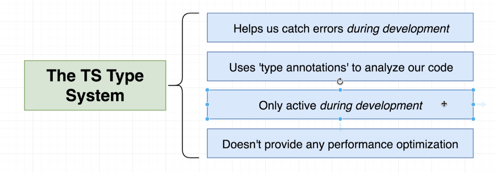

- The only way to see a bug in Javascript is to execute the code
- once the app is deployed or before that run in a browser in a development environment/server, the entire *type system* goes away, the browser and Node.js don't know what Typescript is
- so all the extra syntax added to our code never makes it to the browser nor Node.js
- the typescript compiler compiles the typescript code and produces javascript code, which is what is executed
- unlike other strongly typed languages,  typescript compiler doesn't do any performance optimization

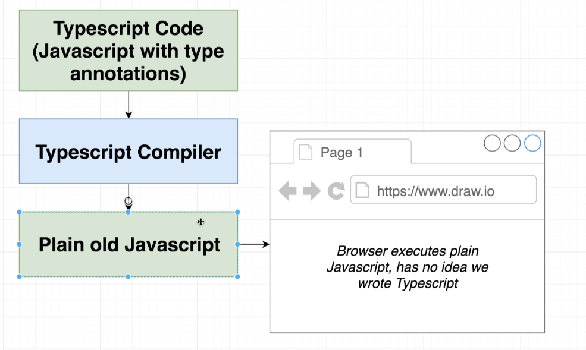

### **<span style='color: #6e7a73'>Environment Setup**

`npm i -g typescript ts-node`

`ts-node` is a command-line tool that allows to compile and execute typescript with a single command

**<span style='color: #f3b4ff'> Copilot** In the terminal, type the following command to check if TypeScript is installed: `tsc --version` If TypeScript is installed, this command will display the installed version of TypeScript.

`tsc --help`


from a terminal, in any location, you can open vscode with `code .` once you added *code* to path

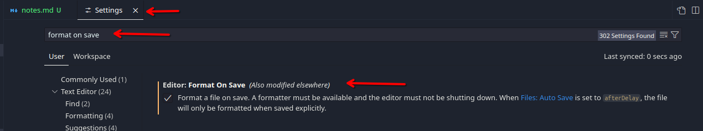

from Settings / prettier: single quote + Settings / Editor: Tab Size

### **<span style='color: #6e7a73'>Important Update About ts-node and Axios**

In the upcoming lecture, we will be installing axios to use in our demo project. To use the latest versions of axios, we need to install the **@types/node** library:

`npm install --save-dev @types/node`

Also, Typescript 5.6 introduced some breaking changes related to imports. ts-node is currently not in sync with this since it has not seen an update since 2023.

In place of ts-node, you will need to use a different library to execute TS code throughout this course.

Instead of running the command as shown in the videos:

`ts-node index.ts`

Use npx tsx instead by running the following command:

`npx tsx index.ts`

### **<span style='color: #6e7a73'>A first app**

- `npm init -y`: to record a project's dependencies inside of a json file
- `npm i axios`

**<span style='color: #ffdf90'>IMPORTANT:** we cannot run typescript code inside the browser or with node.js, we have to first compile the file(s) into plain javascript.

- `tsc index.ts` to compile our typescript file
- `node index.js` to run the created `.js` file

**<span style='color: #bbffff'> Note:** to avoid running `tsc` command all the time, you can use this alternative

- `npm install --save-dev @types/node` & `npm install --save-dev tsx`
- `npx tsx index.ts`

### **<span style='color: #6e7a73'>Catching Errors with TypeScript**

in an `interface` you can ignore properties

As soon as we apply our interface to our response object, **Typescript detects error, during development**, inside the code editor, well before we compiled our code, or tested/ran it. That's the power of typescript and what it's all about!

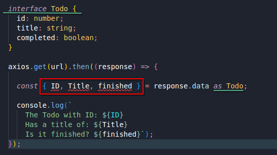

### **<span style='color: #6e7a73'>Types**

Type:  easy way to refer to the different properties and functions that a value has

"red":

- it is a string
- it is a value that has all the properties + methods that we assume a string has

### **<span style='color: #6e7a73'>More on Types**

- string
- date
- boolean
- number
- other types defined in an interface, or built-in the language itself

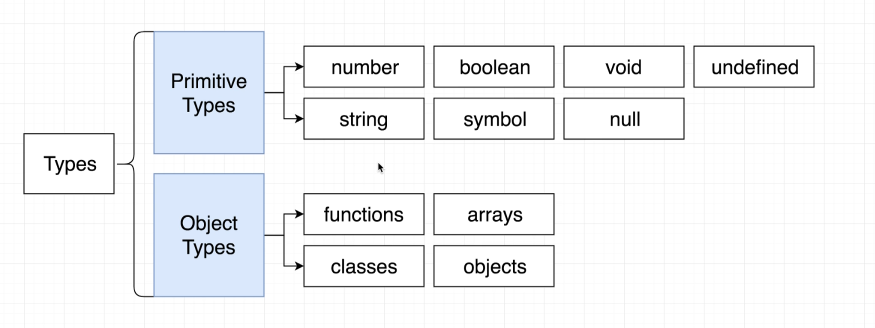

### **<span style='color: #6e7a73'>Examples of Types**

the whole point of types: it is a shortcut to say here are the different properties and methods that this value right here has.

### **<span style='color: #6e7a73'>Type Annotations and Inference**

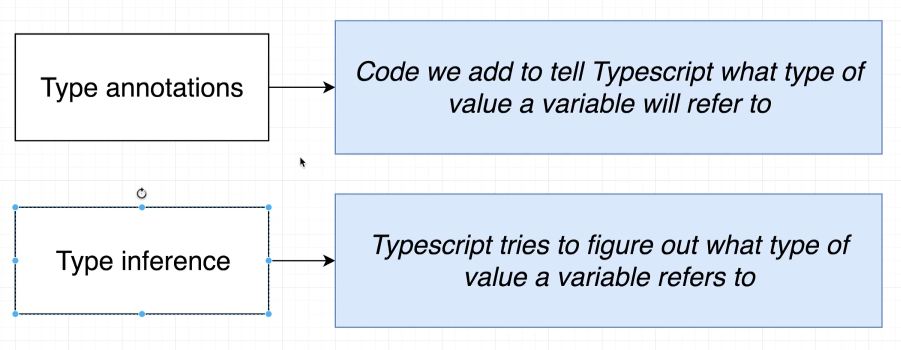

### **<span style='color: #6e7a73'> Annotations around Functions**

`(i: number) => void`, even though it looks like a function, there is no code invoked, it is a description of a function, we are not calling a function.

```typescript
const logNumber: (i: number) => void = (i: number) => {
  console.log(i);
};
```

**<span style='color: #ffdf90'>IMPORTANT:** if we go to our `variables.ts` and delete all the annotations for each value, our code editor will not show any error, this is because of *type inference*, where Typescript guesses the type itself.

### **<span style='color: #6e7a73'> Understanding Inference**
  
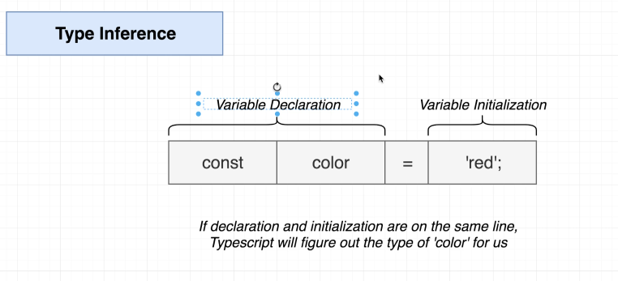

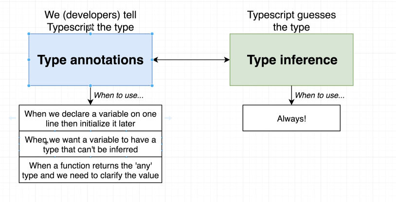

### **<span style='color: #6e7a73'>The Any type**

`JSON.parse(...);` is a function that returns `any`

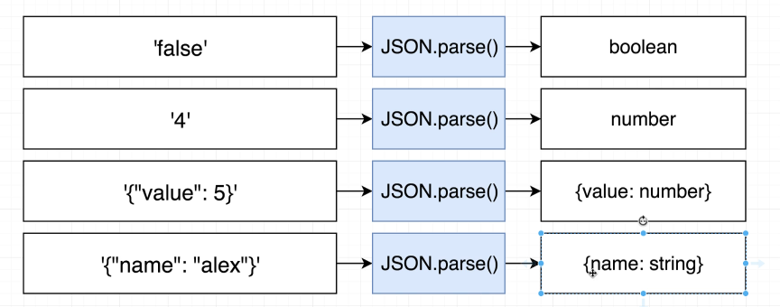

**<span style='color: #bbffff'> Note:**

- TypeScript doesn't know what we're going to get out of `json.parse()` because it depends entirely on the string that we put into that function.
- in the code editor and we call Json.parse(), TypeScript just can't predict what we get back from the function because it will be entirely different based upon the string that we put in.
- So as a shortcut, TypeScript instead decides to simply say, it's not possible to guess all these different types and you get back back the `any` type.
- The `any` type essentially means that TypeScript has no idea what type of value is being returned from a function.

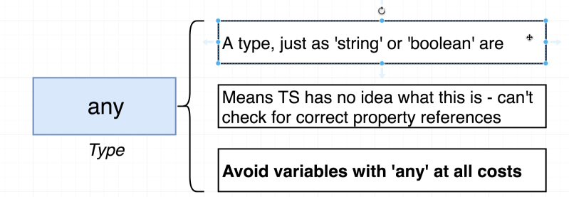

**<span style='color: #ffdf90'>IMPORTANT:** in general, that is a very bad thing to have `any` inside of our application. Remember the entire idea behind TypeScript is that we are using TypeScript to catch errors inside of our code editor and we're able to do that because of types.

**any time we have a variable of type, any, it is generally a bad thing because TypeScript can't do its job.**

### **<span style='color: #6e7a73'>More annotations around functions**

```typescript
const logNumber: (i: number) => void = (i: number) => {
  console.log(i);
};
```

The above annotation is an annotation for the variable. We were telling TypeScript, we're going to assign a value to this variable that's going to have this type.

### **<span style='color: #6e7a73'>Inference around functions**

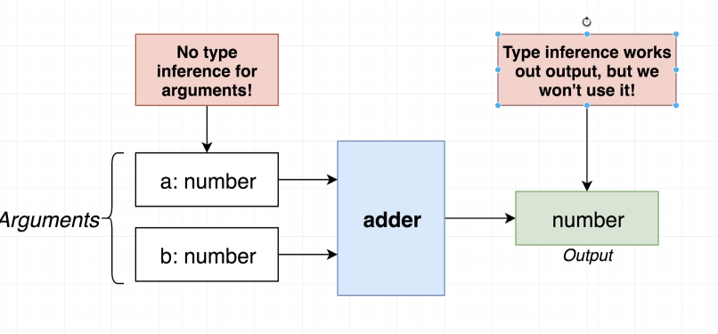

**<span style='color: #bbffff'> Note:** If I now hover over the function, we see an annotation on the variable itself that says the function returns a number. So that's type inference in play. We did not add in a type return annotation, but TypeScript read the body of our function and it knows that we are going to return a number.

So just like we saw with inference before, with variable declarations, we have type inference around only the return value from a function.

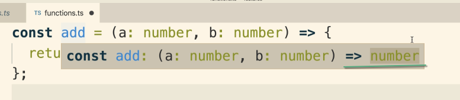

**<span style='color: #ffdf90'>IMPORTANT:** So we don't have to add in that return annotation if we don't want to. However, you and I **always will**.

**<span style='color: #ffb3b3'>Error:** we are always going to use return annotations. It's because we could very easily make a mistake inside of a function and forget to return a value or even return an incorrect type.

we only annotate a function with the type `never` when we really truly never expect a function to return anything ever, if we at least expect it to return something eventually and only possibly throw an error, that's totally fine, We're still going to annotate it with whatever we expect it to eventually return.

### **<span style='color: #6e7a73'>Destructuring with Annotations**

The destructuring portion and the annotation are always going to be the two separate statements separated by that colon `:`

```typescript
const logWeatherDestruct = ({
  date,
  weather,
}: {
  date: Date;
  weather: string;
}): void => {
  console.log(date);
  console.log(weather);
};
```

### **<span style='color: #6e7a73'>Arrays in Typescript**

`const carsByMake = [['f150'], ['corolla'], ['camaro']];`

**<span style='color: #bbffff'> Note:** you only need the `string[][]` syntax to initialize an empty nested array `const carsByMake: string[][] = [];`

### **<span style='color: #6e7a73'>Why typed arrays**

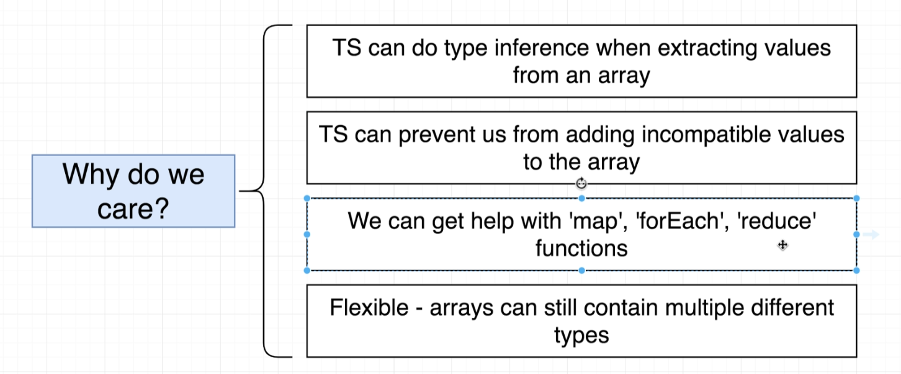

### **<span style='color: #6e7a73'>Multiple types in arrays**

**<span style='color: #ffdf90'>IMPORTANT:** we want as much as possible to avoid the `any` type, that's also the case for arrays, hence `const myDates: [] = []` yielding a type `any` should be avoided.

### **<span style='color: #6e7a73'>Tuples in Typescript**

**<span style='color: #bbffff'> Note:** A tuple: Array-like structure where each element represents some property of a record
<!---
[comment]: it works with text, you can rename it how you want

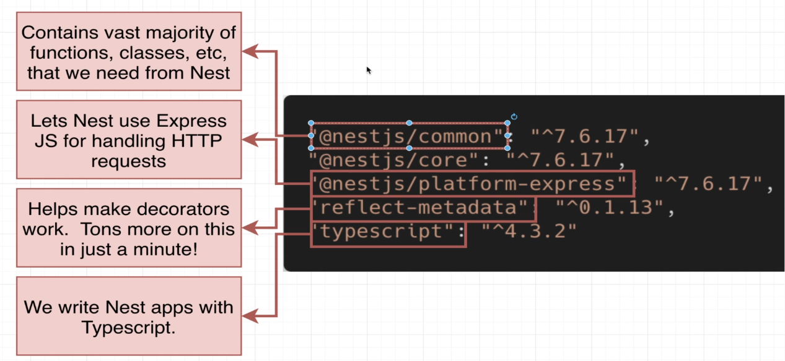

**<span style='color: #ffdf90'>IMPORTANT:**
**<span style='color: #bbffff'> Note:**
**<span style='color: #ffc5a6'>Link:**
**<span style='color: #ffb3b3'>Error:**
**<span style='color: #b0ffb6'> TabButton.jsx**
**<span style='color: #f3b4ff'> Copilot**

**<span style='color: #6e7a73'> Section**

<ins>text to underline</ins>

--- : horizontal line

| Property    | Description | Default |
| -------- | ------- | ------- |
| view engine  | The default engine extension to use when omitted. NOTE: Sub-apps will inherit the value of this setting.    | |
| views |  A directory or an array of directories for the application's views. If an array, the views are looked up in the order they occur in the array. | `process.cwd() + '/views'` |

-->

<!-- markdownlint-enable MD033 -->
<!-- markdownlint-enable MD024 -->