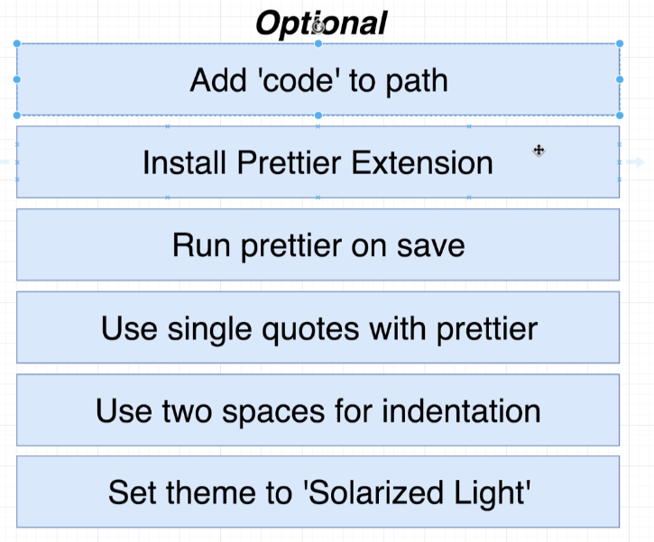

<!-- markdownlint-disable MD033 -->
<!-- markdownlint-disable MD024 -->
# **NestJS: The complete developer's guide**

## **[Bonus] Appendix: TypeScript**

### **TypeScript Overview**

#### overview

Typescript = Javascript + **a type system**

- The only way to see a bug in Javascript is to execute the code
- once the app is deployed or before that run in a browser in a development environment/server, the entire *type system* goes away, the browser and Node.js don't know what Typescript is
- so all the extra syntax added to our code never makes it to the browser nor Node.js
- the typescript compiler compiles the typescript code and produces javascript code, which is what is executed
- unlike other strongly typed languages,  typescrypt compiler doesn't do any performance optimization

### **Environment Setup**

`npm i -g typescript ts-node`

`ts-node` is a command-line tool that allows to compile and execute typescript with a single command

** Copilot** In the terminal, type the following command to check if TypeScript is installed: `tsc --version` If TypeScript is installed, this command will display the installed version of TypeScript.

`tsc --help`

from a terminal, in any location, you can open vscode with `code .` once you added *code* to path

from Settings / prettier: single quote + Settings / Editor: Tab Size

<!---
[comment]: it works with text, you can rename it how you want

**IMPORTANT:**
** Note:**
**Link:**
**Error:**
** TabButton.jsx**
** Copilot**

<ins>text to underline</ins>

--- : horizontal line

| Property    | Description | Default |
| -------- | ------- | ------- |
| view engine  | The default engine extension to use when omitted. NOTE: Sub-apps will inherit the value of this setting.    | |
| views |  A directory or an array of directories for the application's views. If an array, the views are looked up in the order they occur in the array. | `process.cwd() + '/views'` |

-->

<!-- markdownlint-enable MD033 -->
<!-- markdownlint-enable MD024 -->