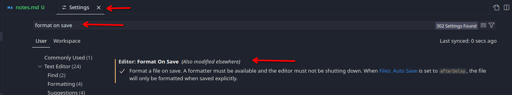
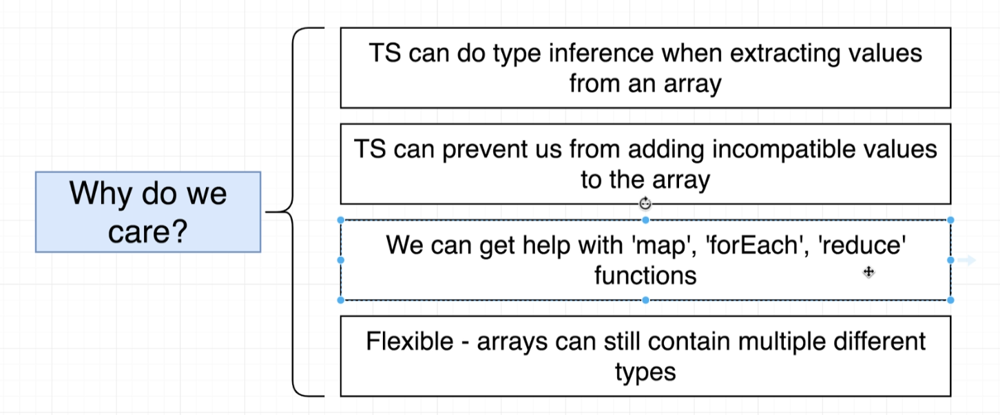
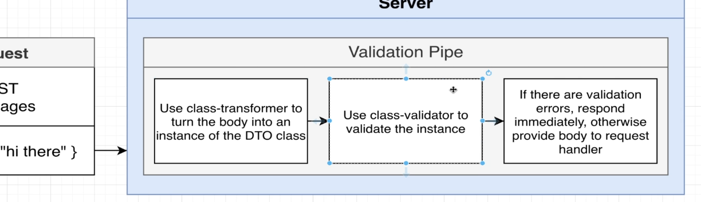
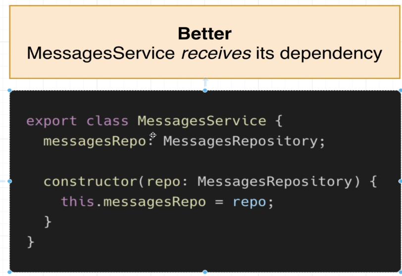
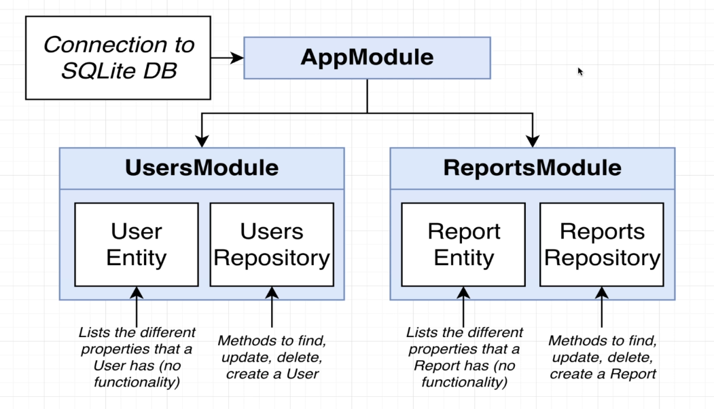
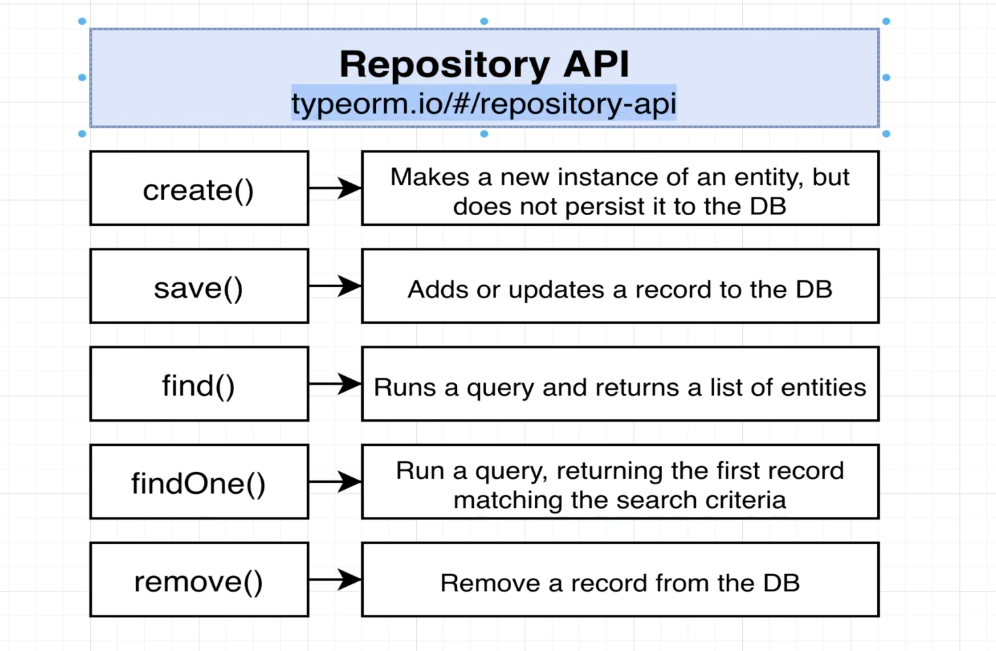
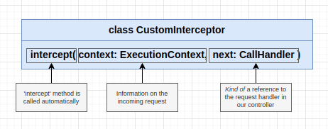

<!-- markdownlint-disable MD033 -->
<!-- markdownlint-disable MD024 -->
# **<span style='color: #6e7a73'>NestJS: The complete developer's guide**

## **<span style='color: #6e7a73'>Generic Comments**

### **<span style='color: #6e7a73'>Eslint**

**<span style='color: #ffc5a6'>Eslint - getting started:** [https://eslint.org/docs/latest/use/getting-started]

`npm init @eslint/config@latest`

### VSCode Editor - fold level

`CTRL + SHIFT + P: Fold level 2`

## **<span style='color: #6e7a73'>[Bonus] Appendix: TypeScript**

### **<span style='color: #6e7a73'>TypeScript Overview**

#### overview

Typescript = Javascript + **a type system**


- The only way to see a bug in Javascript is to execute the code
- once the app is deployed or before that run in a browser in a development environment/server, the entire *type system* goes away, the browser and Node.js don't know what Typescript is
- so all the extra syntax added to our code never makes it to the browser nor Node.js
- the typescript compiler compiles the typescript code and produces javascript code, which is what is executed
- unlike other strongly typed languages,  typescript compiler doesn't do any performance optimization


### **<span style='color: #6e7a73'>Environment Setup**

`npm i -g typescript ts-node`

`ts-node` is a command-line tool that allows to compile and execute typescript with a single command

**<span style='color: #f3b4ff'> Copilot** In the terminal, type the following command to check if TypeScript is installed: `tsc --version` If TypeScript is installed, this command will display the installed version of TypeScript.

`tsc --help`


from a terminal, in any location, you can open vscode with `code .` once you added *code* to path



from Settings / prettier: single quote + Settings / Editor: Tab Size

### **<span style='color: #6e7a73'>Important Update About ts-node and Axios**

In the upcoming lecture, we will be installing axios to use in our demo project. To use the latest versions of axios, we need to install the **@types/node** library:

`npm install --save-dev @types/node`

Also, Typescript 5.6 introduced some breaking changes related to imports. ts-node is currently not in sync with this since it has not seen an update since 2023.

In place of ts-node, you will need to use a different library to execute TS code throughout this course.

Instead of running the command as shown in the videos:

`ts-node index.ts`

Use npx tsx instead by running the following command:

`npx tsx index.ts`

### **<span style='color: #6e7a73'>A first app**

- `npm init -y`: to record a project's dependencies inside of a json file
- `npm i axios`

**<span style='color: #ffcd58'>IMPORTANT:** we cannot run typescript code inside the browser or with node.js, we have to first compile the file(s) into plain javascript.

- `tsc index.ts` to compile our typescript file
- `node index.js` to run the created `.js` file

**<span style='color: #8accb3'> Note:** to avoid running `tsc` command all the time, you can use this alternative

- `npm install --save-dev @types/node` & `npm install --save-dev tsx`
- `npx tsx index.ts`

### **<span style='color: #6e7a73'>Catching Errors with TypeScript**

in an `interface` you can ignore properties

As soon as we apply our interface to our response object, **Typescript detects error, during development**, inside the code editor, well before we compiled our code, or tested/ran it. That's the power of typescript and what it's all about!


### **<span style='color: #6e7a73'>Types**

Type:  easy way to refer to the different properties and functions that a value has

"red":

- it is a string
- it is a value that has all the properties + methods that we assume a string has

### **<span style='color: #6e7a73'>More on Types**

- string
- date
- boolean
- number
- other types defined in an interface, or built-in the language itself


### **<span style='color: #6e7a73'>Examples of Types**

the whole point of types: it is a shortcut to say here are the different properties and methods that this value right here has.

### **<span style='color: #6e7a73'>Type Annotations and Inference**


### **<span style='color: #6e7a73'> Annotations around Functions**

`(i: number) => void`, even though it looks like a function, there is no code invoked, it is a description of a function, we are not calling a function.

```typescript
const logNumber: (i: number) => void = (i: number) => {
  console.log(i);
};
```

**<span style='color: #ffcd58'>IMPORTANT:** if we go to our `variables.ts` and delete all the annotations for each value, our code editor will not show any error, this is because of *type inference*, where Typescript guesses the type itself.

### **<span style='color: #6e7a73'> Understanding Inference**
  


### **<span style='color: #6e7a73'>The Any type**

`JSON.parse(...);` is a function that returns `any`


**<span style='color: #8accb3'> Note:**

- TypeScript doesn't know what we're going to get out of `json.parse()` because it depends entirely on the string that we put into that function.
- in the code editor and we call Json.parse(), TypeScript just can't predict what we get back from the function because it will be entirely different based upon the string that we put in.
- So as a shortcut, TypeScript instead decides to simply say, it's not possible to guess all these different types and you get back back the `any` type.
- The `any` type essentially means that TypeScript has no idea what type of value is being returned from a function.


**<span style='color: #ffcd58'>IMPORTANT:** in general, that is a very bad thing to have `any` inside of our application. Remember the entire idea behind TypeScript is that we are using TypeScript to catch errors inside of our code editor and we're able to do that because of types.

**any time we have a variable of type, any, it is generally a bad thing because TypeScript can't do its job.**

### **<span style='color: #6e7a73'>More annotations around functions**

```typescript
const logNumber: (i: number) => void = (i: number) => {
  console.log(i);
};
```

The above annotation is an annotation for the variable. We were telling TypeScript, we're going to assign a value to this variable that's going to have this type.

### **<span style='color: #6e7a73'>Inference around functions**


**<span style='color: #8accb3'> Note:** If I now hover over the function, we see an annotation on the variable itself that says the function returns a number. So that's type inference in play. We did not add in a type return annotation, but TypeScript read the body of our function and it knows that we are going to return a number.

So just like we saw with inference before, with variable declarations, we have type inference around only the return value from a function.


**<span style='color: #ffcd58'>IMPORTANT:** So we don't have to add in that return annotation if we don't want to. However, you and I **always will**.

**<span style='color: #ff3b3b'>Error:** we are always going to use return annotations. It's because we could very easily make a mistake inside of a function and forget to return a value or even return an incorrect type.

we only annotate a function with the type `never` when we really truly never expect a function to return anything ever, if we at least expect it to return something eventually and only possibly throw an error, that's totally fine, We're still going to annotate it with whatever we expect it to eventually return.

### **<span style='color: #6e7a73'>Destructuring with Annotations**

The destructuring portion and the annotation are always going to be the two separate statements separated by that colon `:`

```typescript
const logWeatherDestruct = ({
  date,
  weather,
}: {
  date: Date;
  weather: string;
}): void => {
  console.log(date);
  console.log(weather);
};
```

### **<span style='color: #6e7a73'>Arrays in Typescript**

`const carsByMake = [['f150'], ['corolla'], ['camaro']];`

**<span style='color: #8accb3'> Note:** you only need the `string[][]` syntax to initialize an empty nested array `const carsByMake: string[][] = [];`

### **<span style='color: #6e7a73'>Why typed arrays**



### **<span style='color: #6e7a73'>Multiple types in arrays**

**<span style='color: #ffcd58'>IMPORTANT:** we want as much as possible to avoid the `any` type, that's also the case for arrays, hence `const myDates: [] = []` yielding a type `any` should be avoided.

### **<span style='color: #6e7a73'>Tuples in Typescript**

**<span style='color: #8accb3'> Note:** A tuple: Array-like structure where each element represents some property of a record.

Remember that the order of the elements inside of a tuple has a specific meaning

### **<span style='color: #6e7a73'>Why Tuples**

Most notably, if you're ever working with a CSV file and you want to represent a single row, you might reach out to a tuple.

**<span style='color: #ffcd58'>IMPORTANT:**

- if we use a tuple to represent some meaningful data, it's really hard to look at tuple values and understand what they are describing. However, in an **object format, because we are forced to put in a key, it is immediately obvious what we are working with.**
- anytime we want to model a record or record it in our application, somehow we're going to stick with a JavaScript convention of reaching for an object as opposed to a tuple.

### **<span style='color: #6e7a73'>Long Type Annotations**

```typescript
const printVehicle = (vehicle: {
  name: string;
  year: number;
  broken: boolean;
}): void => {
  console.log(`Name: ${vehicle.name}`);
  console.log(`Year: ${vehicle.year}`);
  console.log(`Broken: ${vehicle.broken}`);
};
```

**<span style='color: #8accb3'> Note:** this type annotation is really long and hard to read. and if we another function that would take the same parameter, we would then have to duplicate the whole annotation.

### **<span style='color: #6e7a73'>Syntax Around Interfaces**

**<span style='color: #8accb3'> Note:** We are not only limited to expressing primitive values inside of an interface, we can instead express any different type we want to inside of an interface,

- like for example replacing a number by an instance of a date,
- or a function

### **<span style='color: #6e7a73'>Functions In Interfaces**

**<span style='color: #8accb3'> Note:** In Typescript you can pass additional properties / functions than what the interface requires

### **<span style='color: #6e7a73'>Code Reuse with Interfaces**

The two objects `civic` and `drink` represent very different things inside of our application, but they both have a `summary` function that returns a *string*. That means that they are both considered to be of `reportable` type. Because they are both of type reportable, we can use both old civic and drink with the function.

**<span style='color: #ffcd58'>IMPORTANT:** The point is that we can use a single interface to describe the shape or the different properties of very different objects. we can make these very different objects, interact with different functions that we create, like `printSummary`.

**So this encourages us to write somewhat generic looking functions.**

### **<span style='color: #6e7a73'>General plan with Interfaces**


### **<span style='color: #6e7a73'>Classes**

Classes: Blueprint to create an object with some fields (values) and methods (functions) to represent something

### **<span style='color: #6e7a73'>Basic Inheritance**

When we have a class that extends another, we can optionally choose to override different methods.

### **<span style='color: #6e7a73'>Class Method modifiers**

modifiers restrict access to different functions & variables, the default value is `public`


#### private

**<span style='color: #ff3b3b'>Error:**


when you assign `private` this function can only be called inside the class by other functions of the class itself.

**<span style='color: #ff3b3b'>Error:** f the child class has a different modifier than its parent class, if in a child class you override a method, you're not authorized to change its modifier.

### **<span style='color: #6e7a73'>Field in Classes**

`constructor(public color: string) {}` is a short version for below:

```typescript
class abc {
  color: string;
  constructor(color: string){
    this.color = color;
  }
}
```

**<span style='color: #8accb3'> Note:** Modifiers apply to class variable just as they do for methods.

### **<span style='color: #6e7a73'>Fields with inheritance**

If a child class has no constructor, then Typescript will execute the constructor of the parent.

### **<span style='color: #6e7a73'>Setting up Maps project**

- `npm init -y`
- `npm init @eslint/config@latest`
- `npm install --save-dev @types/node`
- `npm install --save-dev tsx`
- remove from `package.json` `"main": "index.js",` and then `npx parcel index.html`

### **<span style='color: #6e7a73'>Important Info about Faker**

IMPORTANT Info About Faker Installation

In the upcoming lecture, we will be installing the Faker library. You may notice that the GitHub repository for Faker is empty or is displaying some confusing messaging. The library currently no longer exists and is not being maintained.

A community fork of Faker was made to save the project: <https://github.com/faker-js/faker>

To use this library, you can install it by running: `npm i @faker-js/faker`

You'll then need to update all of your imports: `import { faker } from "@faker-js/faker";`

As of their v6 release, TS support is now native and does not require installing the @types declarations: <https://github.com/faker-js/faker#typescript-support>

### **<span style='color: #6e7a73'>Type Definition Files**

**<span style='color: #ff3b3b'>Error:** *Could not find a declaration file for module faker*

A type definition file is going to tell the TypeScript compiler all the different functions that are available inside this JavaScript library, what type of argument they take and what type of value those functions return.

you can think of these type definition files as like an adapter layer.

Sometimes **type definition files** will be installed automatically when you install a JavaScript library. That was the case for Axios.

`definitelyTypedProject`: type definition files for JavaScript libraries.

### **<span style='color: #6e7a73'>Using Type Definition Files**

`index.d.ts` is the typical type definition file, which only contains typescript syntax, its only goal is to describe the different types of values, object functions that exist inside the library

### **<span style='color: #6e7a73'>Google Maps Integration with TypeScript**

to check that the google maps api has been correctly installed you can enter `google` in the devtools console, and it should return an object.

Usually when we make use of TypeScript, we install dependencies using NPM and we import them with normal import statement.

However, this time we have added in a script directly to our HTML file `index.html`, and so that script is going to be added into our project as a **global variable**. It means that essentially inside of our devtools console,you can type `google`; this is a global variable, that is available everywhere inside of our project **without import statements**.

The only issue is that if we flip back over to our editor and inside of our `index.ts`, if just write out `google` by itself. we'll see an error message here that says cannot find any name *google*.

**<span style='color: #ff3b3b'>Error:** So the reason we are seeing this is that TypeScript just doesn't understand that there is a global variable available inside of our project.

**<span style='color: #8accb3'> Note:** We need to help TypeScript understand that there will be a global variable available inside of our project and we need to help it understand the different methods that are available on this google object, we need to install another type definition file: `npm install @types/google.maps`

**<span style='color: #ffcd58'>IMPORTANT:** The goal of a type definition file is to help TypeScript understand how a third party JavaScript library works.


### **<span style='color: #6e7a73'>Exploring Type Definition Files**

**<span style='color: #ff3b3b'>Error:**  If map is not showing change 100% to **100vh**

`<div id="map" style="height: 100vh"></div>`

**<span style='color: #ff3b3b'>Error:** Add a Reference to the Global Type

If the above doesn't work, you can explicitly reference the type definitions in your index.ts file by adding this at the top: `/// <reference types="google.maps" />`

**<span style='color: #ff3b3b'>Error:** Exposing Google Maps API key to Github / HTML:

Go to this address: <https://console.developers.google.com/apis>  
Click on "Credentials" > "Edit Key"  
Under "Application restrictions", select "HTTP referrers (web sites)"  
Under "Website restrictions", Click on "ADD AN ITEM"  
Type your website address (or "localhost", "127.0.0.1", "localhost:port" etc for local tests) in the text field and press ENTER to add it to the list  
SAVE and Use your key in your project

We can use a wrapping class, `CustomMap` to hide some methods exposed by the Google Maps Api, and only expose the one we want.

### **<span style='color: #6e7a73'>Adding Markers**

**<span style='color: #ff3b3b'>Error:** The map is initialized without a valid Map ID, which will prevent use of Advanced Markers.

Pass the Map ID to the `google.maps.Map` constructor  
Update the CustomMap class to include the mapId in the map options:

```javascript
constructor(divId: string) {
  this.googleMap = new google.maps.Map(
    document.getElementById(divId) as HTMLElement,
    {
      zoom: 1,
      center: {
        lat: 0,
        lng: 0,
      },
      mapId: 'YOUR_MAP_ID', // Add your Map ID here
    }
  );
}
```

### **<span style='color: #6e7a73'>One Possible Solution**

**<span style='color: #aacb73'> CustomMaps.ts**: `addMarker(mappable: User | Company){}`

TypeScript is going to do a little powering down operation to limit the number of properties that we can actually reference on `mappable`.

when using this `|` operator, TypeScript is going to take a look at the two different types and it's going to say you can only refer to properties on that argument if they exist in both of these different types.

**<span style='color: #ffcd58'>IMPORTANT:** this approach is not ideal as it will make very long function signature as we have to add new types, it's **not scalable** and more importantly it is adding a **tight-coupling** between our `Map.ts` class and every other classes of our app we want to show with a marker.

### **<span style='color: #6e7a73'>Restricting Access with Interfaces**

**<span style='color: #ff3b3b'>Error:** the issue with our current approach is that custom map has a direct dependency on all the different classes inside of our application that we might want to show on the map. So custom map depends upon user, it depends upon company.

**<span style='color: #ffcd58'>IMPORTANT:** So to fix this issue, we're going to **invert this dependency**, rather than custom map.

class `User.ts`, if you want to work with a `CustomMap.ts`, it is up to you to satisfy the map's requirements and same for `Company`.

### **<span style='color: #6e7a73'>Showing Popup Windows**

**<span style='color: #ffc5a6'>Link:** <https://developers.google.com/maps/documentation/javascript/infowindows>

### **<span style='color: #6e7a73'>Optional Implements Clauses**

by implementing the `Mappable` interface on our `User` and `Company` classes,  TypeScript is helping us point out the true source of the error, pointing out errors in user /company classes, rather than only in the `index.ts` file before this implementation, and informing us which classes definition have to updated.

## **<span style='color: #6e7a73'>The Basics of Nest**

### **<span style='color: #6e7a73'>Project setup**

`npm i @nestjs/common @nestjs/core @nestjs/platform-express reflect-metadata typescript`

### **<span style='color: #6e7a73'>Steps**

- install deps
- setup typescript compiler settings
- create a Nest module and controller
- start the app

### **<span style='color: #6e7a73'>TypeScript Configuration**


**<span style='color: #8accb3'> Note:** Express is the default server

`tsconfig.json`:   experimentalDecorators & emitDecoratorMetadata are 2 crucial features that make Nestjs work.

### **<span style='color: #6e7a73'>Creating a Controller**

any server that you set-up will look like something below:


### **<span style='color: #6e7a73'>Starting Up a Nest App**

`npx tsx src/main.ts`

### **<span style='color: #6e7a73'>Routing Decorators**

**<span style='color: #aacb73'> app.controller.ts**

```typescript
@Controller('/app')
export class AppController {
  @Get('/home')
// ....
}
```

the correct route now becomes: <http://localhost:3000/app/home>

**<span style='color: #8accb3'> Note:** we're going to use the controller decorator to control some high level routing rules that are going to apply to all of the different route handlers that we set up inside this controller. And then in theory, all the different methods we define inside this controller are going to have a different route

## **<span style='color: #6e7a73'>Generating Projects with the Nest CLI**

### **<span style='color: #6e7a73'>App setup**

from your terminal: `sudo npm install -g @nestjs/cli`

`nest new 3_messages`

#### Git

When creating a new NestJS project, you can delete the `.git` initialization with `rm -rd .git*`

### **<span style='color: #6e7a73'>Using the Nest CLI to Generate Files**

to start your *NestJS* project in watch mode; `npm run start:dev`

To start fresh, from the automatically created project, we remove:

- app.controller.spec.ts
- app.controller.ts
- app.module.ts
- app.service.ts

to create our *module*, `nest generate module messages`

### **<span style='color: #6e7a73'>More on generating files**

creating the controller: `nest generate controller messages/messages --flat`


### **<span style='color: #6e7a73'>VSCode REST Client Extension**

**<span style='color: #aacb73'> request.http**

separate each http request with `###`

## **<span style='color: #6e7a73'>Validating Request Data with Pipes**

### **<span style='color: #6e7a73'>Accessing Request Data with Decorators**


### **<span style='color: #6e7a73'>Using Pipes for validation**


### **<span style='color: #6e7a73'>Adding Validation Rules**

- Create a class that describes the different properties that the request body should have: **Data Transfer Object === Dto**
- Add a library `npm i class-validator class-transformer`, to add validation rules to the class
- Apply that class to the request handler

### **<span style='color: #6e7a73'>Behind the Scenes of Validation**

**<span style='color: #ffc5a6'>Class Transformer:** <https://github.com/typestack/class-transformer>

### **<span style='color: #6e7a73'>How Type Info is Preserved**



## **<span style='color: #6e7a73'>Nest Architecture: Services and Repositories**

### **<span style='color: #6e7a73'>Services and Repositories**


**<span style='color: #8accb3'> Note:** it starts to get really confusing why we create a service and how it's different from a repository. And that's because we very frequently end up with methods on the service that look absolutely identical to the underlying repository. And you are going to end up in a scenario where you say, Why are we creating this service at all?

**<span style='color: #ffcd58'>IMPORTANT:** we still want to make these services. There are very good reasons for setting up these services and having them behave as sort of like a proxy that sits in front of our repositories.

- access multiple kinds of data
- combine multiple different repositories
- testing

### **<span style='color: #6e7a73'>Implementing a repository**

**<span style='color: #aacb73'> message.repository.ts**

We're going to import helper functions from the *NodeJS* standard library.

```typescript
import { readFile, writeFile } from 'fs/promises';
```

### **<span style='color: #6e7a73'>Implementing a Service**

**<span style='color: #aacb73'> message.service.ts**

```typescript
constructor() {
  // Service is creating its own dependencies
    this.messagesRepo = new MessagesRepository();
  }
```

**<span style='color: #ff3b3b'>Error:** We have set up a dependency between these two classes: `message.service` and `message.repository`, and the service is creating its own dependency. This is something that we do not do in *NestJS*.

**<span style='color: #ffcd58'>IMPORTANT:** We do not have any class creating its own dependencies inside of a constructor. Instead, we're going to use a very special system in *NestJS* referred to as **dependency injection to set up dependencies between different classes**.

### **<span style='color: #6e7a73'>Reporting Errors with Exceptions**

`node_modules/@nestjs/common/exceptions`, you can find files for each of these very common Http status codes are wrapped up inside these different exceptions.

### **<span style='color: #6e7a73'>Understanding Inversion of Control**

**<span style='color: #ffcd58'>IMPORTANT:** Inversion of Control Principle: if you want to have reusable code, classes should not create instances of its dependencies on its own.





- whenever you create a copy or an instance of `messagesService`, you must provide an object that satisfies the *repository interface*.
- the reason this is best is that we do not rely upon getting exactly the `messagesRepository`. Instead, our code can work perfectly fine as long as you pass it any object that satisfies this interface. It could be the `messagesRepository`, or it could be a totally different kind of repository with a totally different implementation.


**<span style='color: #8accb3'> Note:** whenever we write out automated testing, we want our code to run as fast as possible. We want the test to execute very, very quickly. Whenever you are doing automated testing, it is generally bad practice to have any tests that actually try to write files or retrieve resources from the hard disk.

So if we were trying to write a test around messages service, ideally we would not use the real messages repository because that thing tries to write to the hard disk. Instead what we could do in this automated testing environment. If we were using this good version of our code, we could very quickly create a fake repository. So some extra class that only exists in the automated testing world.

This class could have all the required methods like *findOne, findAll and create.* But rather than actually writing a file to the hard drive and reading from a file on the hard drive, maybe the fake repository could just store a list of messages in memory.

**<span style='color: #ffcd58'>IMPORTANT:** it's only through the use of this interface right here that we can pass in any kind of object to be used as a repository.  we can swap out the dependency for `messagesService` if perhaps it's more advantageous to give it a different repository. This makes `messagesService` easier to test and possibly more usable as well.

### **<span style='color: #6e7a73'>Introduction to Dependency Injection**

**<span style='color: #ffcd58'>IMPORTANT:** **Dependency injection** is all about making use of inversion of control, but not having to create a ton of different classes or a ton of different instances every single time. **So the total linchpin of how dependency injection works is something called a container.** DI Container / Injector, that list all classes and their dependencies

### **<span style='color: #6e7a73'>Refactoring to Use Dependency Injection**

#### **<span style='color: #6e7a73'>DI Container Flow**


#### **<span style='color: #6e7a73'>using Typescript Synthetic sugar with Dependency Injection**

**<span style='color: #8accb3'>Note:** The 2 below are absolutely equivalent and the later saves a lot of boiler plate code

```typescript
export class MessagesService {
  messagesRepo: MessagesRepository;

  constructor(messagesRepo: MessagesRepository) {
    this.messagesRepo = messagesRepo;
  }
// ...
}
```

```typescript
export class MessagesService {
  constructor(public messagesRepo: MessagesRepository) {  }
// ...
}
```

To register classes in DI Container, we use the `@Injectable()` decorator.

**<span style='color: #8accb3'> Note:** We don't have to register our `Controller` with our container as the controller only consumes classes and NestJS automatically does it for us.

**<span style='color: #aacb73'> messages.module.ts** Inside our module file, we need to add a new property `providers` to the `@Module()` decorator, listing classes that can be used as dependencies to others.

```typescript
@Module({
  controllers: [MessagesController],
  providers: [MessagesService, MessagesRepository],
})
```

**<span style='color: #8accb3'> Note:** In NestJS, at no point in time during this refactor, did we have to:

- create a container/injector: even though it exists in our application, we never really interact with it directly
- doing explicit registration, instead we add the *Injectable()* decorators to dependencies and the `providers` property to the module to list them.

### **<span style='color: #6e7a73'>Few More Notes on DI**

**<span style='color: #8accb3'> Note1:** we didn't make use of `interface` due to  TypeScript implementation which is a bit more difficult

**<span style='color: #8accb3'> Note2:** The container maintains a list of all instances it has created. Whenever a container creates a dependency instance, it is going to store it internally and reuse it over time, if you ask for it again. We have to keep in mind, the same instance of the service is shared in multiple locations inside our project.

**<span style='color: #8accb3'> Note3:** It is possible to get also a brand new copy/instance of a dependency when needed

#### **<span style='color: #6e7a73'>What do we gain by making use of DI in NestJS**

Testing a NestJS application with dependency injection, implementing Inversion of Control Principle will be far easier. This is the main payout!

## **<span style='color: #6e7a73'>Nest Architecture: Organizing code with Modules**

### **<span style='color: #6e7a73'>Generating a few files**

delete all files in `./src` but `main.ts`

`nest g module computer`

`nest g service cpu`

`nest g controller computer`

### **<span style='color: #6e7a73'>Setting Up DI Between Modules**


### **<span style='color: #6e7a73'>Consuming Multiple Modules**

to test the app, [http://localhost:3000/computer]

## **<span style='color: #6e7a73'>Big Project Time**

### **<span style='color: #6e7a73'>API Design**


### **<span style='color: #6e7a73'>Module Design!**


### **<span style='color: #6e7a73'>Generating Modules, Controllers, and Services**

**<span style='color: #8accb3'> Note:** Remember, we do not use the `nest cli` to generate repositories for us. The reason for this is that these repositories are almost always going to be very, very different depending upon how we are storing our data.

## **<span style='color: #6e7a73'>Persisting Data with TypeORM**

### **<span style='color: #6e7a73'>Persistent Data with NestJS**


### **<span style='color: #6e7a73'>Setting Up a Database Connection**



`npm i @nestjs/typeorm typeorm sqlite3`

**<span style='color: #ffcd58'>IMPORTANT:** this is very important when we are using type ORM, we do not have to create repository files manually as we did on our last `messages` application. Instead, these repositories are going to be created for us automatically behind the scenes. We don't even end up seeing a generated file. These are two classes that will be created for us.

**<span style='color: #8accb3'> Note:** THe SQLite connection that we create in **<span style='color: #aacb73'> app.module.ts** is going to be automatically shared down into the all the other modules inside of our project.

### **<span style='color: #6e7a73'>Creating an Entity and Repository**


**<span style='color: #8accb3'> Note:** Note that instead of using the NestJS convention to name the class *UserEntity* in a `user.entity.ts` file, we name the class *User*.

### **<span style='color: #6e7a73'>Understanding TypeORM Decorators**

#### **<span style='color: #6e7a73'>SQL Migration**


#### **<span style='color: #6e7a73'>TypeORM**

**<span style='color: #8accb3'> Note:** notice that inside of our project:

- **We have not written out any migration**.
- We have not manually created our database.
- We have not really set up any rigid structure around our data.

That is because *TypeORM* has a very special feature in it referred to as the `synchronization=true` feature.  This feature right here is only for use in the development environment. This option, when set to true, is going to cause type to take a look at the structure of all your different entities and then automatically update the structure of your database.

- It's going to create and remove tables.
- It will add and remove columns and it will change the type of data stored in these columns.

And this is all done automatically through type ORM with the use of those entities and all those different decorators.

**<span style='color: #ffcd58'>IMPORTANT:** It is extremely important that we never run that migrate or that `synchronize` feature of `true` in a production environment.

### **<span style='color: #6e7a73'>Quick note on Repositories**



### **<span style='color: #6e7a73'>Few extra routes**


### **<span style='color: #6e7a73'>Setting Up Body Validation**

`npm i class-validator class-transformer`

### **<span style='color: #6e7a73'>Manual Route Testing**

**<span style='color: #aacb73'> src/users/requests.http**

```html
POST <http://localhost:3000/auth/signup>
Content-Type: application/json

{
  "email": "<test@test.com>",
  "password": "test1234",
  "admin": true
}
```

**<span style='color: #ffcd58'>IMPORTANT:** extra property such as `admin` inside the body of the request are ignored. This is done primarily as a security concern because we don't want to allow users to add in additional properties to incoming requests

## **<span style='color: #6e7a73'>Creating and Saving User Data**

### **<span style='color: #6e7a73'>Creating and Saving a User**

**<span style='color: #aacb73'> src/users/users.service.ts**

```typescript
@Injectable()
export class UsersService {
  repo: Repository<User>;

  constructor(repo: Repository<User>) {
    this.repo = repo;
  }
}

// NOTE: identical to:
@Injectable()
export class UsersService {
  constructor(private repo: Repository<User>) { }
}
```

```typescript
constructor(@InjectRepository(User) private repo: Repository<User>) {}
```

**<span style='color: #8accb3'> Note:** `@InjectRepository(User)` is a bit of an aid to the dependency injection system. This is what is going to tell the dependency injection system that our `UsersService` needs the `userRepository`.

**<span style='color: #ffcd58'>IMPORTANT:**

- when we spoke about dependency injection a little bit ago, we said that the dependency injection system uses this type annotation right here to figure out what instance it needs to inject into this class at runtime.
- Unfortunately, the dependency injection system does not play nicely with generics, which `<User>` is. So the decorator is required simply because we have to use a generic type.

#### **<span style='color: #6e7a73'>TypeORM Repository API**

- `create()`: makes a new instance of an entity, but does not persist it to the DB
- `save()`: adds or updates a record to the DB

### **<span style='color: #6e7a73'>Quick breathe and review**


**<span style='color: #8accb3'> Note:** you might be kind of curious why would we do validation that is tied to the *entity* as opposed to inside of our *DTO*?

Well, there are a couple of scenarios where we would want to do that and we're going to take a look at some of them later on inside this application.

Right now, just understand that in general, we do want to first create an instance of our entity and then save it off, as opposed to just passing off our data to be saved directly to the save method.

```typescript
create(email: string, password: string) {
  const user = this.repo.create({ email, password });
  return this.repo.save(user);
}

// NOTE: rather than:
create(email: string, password: string) {
  return this.repo.save({email, password});
}
```

### **<span style='color: #6e7a73'>More on Create vs Save**

Hooks in *TypeORM* allow us to define functions on an entity that will be called automatically at certain points in time.

#### **<span style='color: #6e7a73'>Create vs Save: Hooks**


**<span style='color: #ffcd58'>IMPORTANT**

- Hooks are not executed if you call `save()` with a plain object instead of the entity created via `create()`.
- So as a general rule of thumb, we really need to decide up front if we want to use any hooks inside of our project. Chances are you do, and if you do, then whenever you are trying to insert a new record, update a record or remove a record, you need to first get your entity instance and then call save or update or remove with this entity, as opposed to just trying to save a plain object.

**<span style='color: #ffcd58'>IMPORTANT**

- `save()` and `remove()` are supposed to be called with an entity and hooks will be executed.
- with `insert()`, `update()`, `delete()`, hooks will not be executed

### **<span style='color: #6e7a73'>Querying for Data**

`findOne` always return one result or `null`, while `find` returns an array of results matching that search criteria (or empty array if no matches).

### **<span style='color: #6e7a73'>Updating Data**

we want to pass to our `update` method a flexible object to which we can pass one or more attribute of `User` entity.

**<span style='color: #aacb73'> src/users/users.service.ts:** `update(id: number, attrs: Partial<User>) {}`

`Object.assign(user, attrs);` takes all the properties of the second argument and copies it the object passed in, overriding the properties already there.

### **<span style='color: #6e7a73'>Finding and Filtering Records**

**<span style='color: #ff3b3b'>Error:** whenever we receive a request, every single part of the URL is a string, even if we think that it looks like a number. *NestJS* is not going to automatically parse the incoming request into a string.

### **<span style='color: #6e7a73'>A Few Notes on Exceptions**

**<span style='color: #aacb73'> src/users/users.service.ts**

**<span style='color: #8accb3'> Note:** `if (!user) throw new Error('user not found!');`; we would not throw a plain error object because *NestJS* doesn't really know how to extract any information from that.

Instead, we should be throwing exceptions that are implemented or created by *NestJS*, such as the notfound exception, the bad request exception.

**<span style='color: #8accb3'> Note:** In our previous app, we were throwing errors from the controller and not from the service


**<span style='color: #ff3b3b'>Error:** To tackle the above issue that `NotFoundException` would not be caught in other protocols than `HTTP` controllers (websocket, gprc), a very easy thing to do  would be to implement your own exception filter.

## **<span style='color: #6e7a73'>Custom Data Serialization**

### **<span style='color: #6e7a73'>Excluding Response Properties**


### **<span style='color: #6e7a73'>Solution to Serialization**


**<span style='color: #8accb3'> Note:** we really need to customize that `@Exclude()` directive and how it gets applied on the `user.entity` instance based upon which route handler is being accessed. And that is really not possible by using the approach recommended by *NestJS*.

There is a slightly different approach that's going to address this whole issue.

#### **<span style='color: #6e7a73'>Custom Interceptor**


We will then have a separate DTO for each route, with a different set of serialization rules

### **<span style='color: #6e7a73'>How to Build Interceptors**

We can assign interceptors to either:

- routes
- or controller; and so the interceptor will run on every handler of the controller
- globally to an entire application



**<span style='color: #ffcd58'>IMPORTANT:** **Implements is not the same as extends**.

- We make use of `extends` whenever we are subclassing an existing class.
- We make use of `implements` anytime that we want to create a new class that satisfies all the requirements of either an abstract class or an interface. So by adding on `implements NestInterceptor`, TypeScript is going to check all the methods that exist in this interface.

**<span style='color: #aacb73'> src/interceptors/serialize.interceptor.jsx**

```typescript
export class SerializeInterceptor implements NestInterceptor {
  //NOTE: Run something before a request is handled by the request handler
  intercept(context: ExecutionContext, handler: CallHandler): Observable<any> {
    console.log('Im running before the handler', context);

    return handler.handle().pipe(
      map((data: any) => {
        //NOTE: Run something before the response is sent out
        console.log('Im running before response is sent out', data);
      }),
    );
  }
}
```

### **<span style='color: #6e7a73'>Serialization in the Interceptor**

`import { Expose } from 'class-transformer';` is the exact opposite of `@Exclude()` decorator.

### **<span style='color: #6e7a73'>A Bit of Type Safety Around Serialize**

**<span style='color: #ffc5a6'>Link:** [https://medium.com/@raphael3213/serialize-interceptors-in-nestjs-b99c1e347ba4]

## **<span style='color: #6e7a73'>Authentication from scratch**

### **<span style='color: #6e7a73'>Authentication overview**


### **<span style='color: #6e7a73'>Reminder on Service setup**


### **<span style='color: #6e7a73'>Understanding password hashing**


#### **<span style='color: #6e7a73'>Rainbow Table attack**

The idea behind a rainbow table attack is that some malicious person out there is going to get a list of all the different most popular passwords across the world.

They're then going to run through this list of maybe hundreds or thousands or even millions of different very common passwords. And they're going to calculate the hash of every one of these very common passwords ahead of time. they can just store this table. They never have to run this calculation again.

So then if this malicious user ever got access to our database in some way, they could take a look at our hashed password. They could then compare our stored hashed password right here against all these pre-calculated hashes that they ran ahead of time.

#### **<span style='color: #6e7a73'>Salt**


during the sign up process we are generating that salt and storing it inside of our database. And then during the sign in process we're going to go into the database, find that salt and use it inside of our hashed password hashing process.

in order to do a rainbow table attack, which all revolves around this idea of kind of **pre-calculating these different hashes ahead of time**. Someone to put together this rainbow table attack would now have to do a series of different entries where they take a password and then they guess a salt. But the key thing here is that the user or this malicious person would have to regenerate this entire rainbow table with a different salt for every different possible salt there is in the world out there.

### **<span style='color: #6e7a73'>Salting and Hashing the password**

**<span style='color: #8accb3'> Note:** The plain version of *script* returns callback, we're going to wrap it up with *promisify*, which returns promises, rather than callbacks

The eight right here means that our buffer is going to have eight bytes worth of data inside of it.

**<span style='color: #aacb73'> auth.service.ts** `const salt = randomBytes(8).toString('hex');`

Every one byte of data turns into two characters when we convert it to Hex. So our salt is going to be a 16 character long string.

as we use `promisify`, TypeScript has no idea what `scrypt` function returns, to help it, we wrap the expected type with the `as` clause: `const hash = (await scrypt(password, salt, 32)) as Buffer;`

### **<span style='color: #6e7a73'>Setting up Sessions**


`npm i cookie-session @types/cookie-session`

**<span style='color: #aacb73'> main.ts/bootstrap()**

```typescript
app.use(cookieSession({ keys: ['randomCookieString'] }));
```

**<span style='color: #ff3b3b'>Error:** you have to add to `tsconfig.json`:  "esModuleInterop": true

### **<span style='color: #6e7a73'>Signing in a User**

**<span style='color: #8accb3'> Note:** Whenever we try to make a change to that session object, `cookie-session` is going to take a look at whatever change we just made and if you didn't actually change any properties, if they're all identical, it's not going to send back any updated cookie in the response.

Between the two different request handlers `/signup` and `/signin`, because there have been no actual changes to the session object, whenever we make a request to the second one, we're not going to see any updated cookie come back because there is no updated cookie.

### **<span style='color: #6e7a73'>Two Automation Tools**


The data argument is going to contain any data or any argument that we provide to our decorator when we actually make use of it.

**<span style='color: #aacb73'> users.controller.ts**

### **<span style='color: #6e7a73'>Why a Decorator and Interceptor**

```typescript
 @Get('whoami')
  whoAmI(@CurrentUser('This would be the data') user: string) {
    return user;
  }
```

**<span style='color: #aacb73'> current-user.decorator.ts**

The current user decorator is going to be just the decorator by itself. No arguments, nothing like that. A better type annotation for data than any might be `never`.

```typescript
export const CurrentUser = createParamDecorator(
  (data: any, context: ExecutionContext) => {
    return 'hi there!';
  },
);
```

**<span style='color: #ffcd58'>IMPORTANT:** our user service is a part of the dependency injection system. We can't just import the `usersService` and create a new instance of it ourselves. The service makes use of the user's repository and that user's repository is set up only through dependency injection.

Unfortunately, we cannot make use of dependency injection with a parameter decorator.

We're making a parameter decorator, and this decorator cannot reach into the system in any way and try to get access to some instance of anything inside there. So we currently have a decorator that just plain can't get access to our `usersService`.

**<span style='color: #ff3b3b'>Error**


**<span style='color: #aacb73'> src/users/interceptors/current-user.interceptor.ts**

So now we've got the user, but what are we going to actually do with it? We need to somehow communicate the user we found down into the decorator. the little trick we're going to use is to just take the user we found and assign it to the `request` object because the request object can be retrieved or we can get access to that object inside of our decorator.

**<span style='color: #8accb3'> Note:** Couldn't we just use the interceptor by itself? Well, yes, we absolutely could.

But remember, one of the requirements of our controller one one of the things that I said was that I want to specifically have a decorator called `@CurrentUser()`, and that thing should give us our user.

Alternative with only an interceptor would be

**<span style='color: #aacb73'> src/users/users.controller.ts**

```typescript
@Get('/whoami')
whoAmI(@Request() request: Request){
  console.log(request.currentUser)
}
```

### **<span style='color: #6e7a73'>Connecting an Interceptor to Dependency Injection**

Now, the key thing to keep in mind here is that whenever we want to use that decorator, we first have to run the interceptor. So the interceptor has to run first to make sure that we assign the current user to the request object. After the interceptor runs, then our decorator can run and return request dot current user.

we can apply this decorator to an entire controller and that makes sure that we're going to run a given interceptor before any handler inside of that controller.

**<span style='color: #aacb73'> src/users/users.controller.ts**

```typescript
@Controller('auth')
@Serialize(UserDto)
@UseInterceptors(CurrentUserInterceptor)
export class UsersController {}
```

### **<span style='color: #6e7a73'>Globally Scoped Interceptors**

**<span style='color: #ff3b3b'>Wrong Pattern**


#### **<span style='color: #6e7a73'>Globally Scoped Interceptors**


Now, the one downside to this approach is that there might be some controllers out there that don't care about who the current user is.

In those cases, we are going to make a request to our database to find the current user, even though the given controller might not care about it, or even individual handlers might not care about the current user. So there are definitely upsides and downsides to this approach.

## **<span style='color: #6e7a73'>Getting Started with Unit Testing**

### **<span style='color: #6e7a73'>Testing Overview**


We're going to use the dependency injection system to avoid having to create all these different repositories, these different dependencies.

So the trick is we are going to make a fake copy of the user's service. So this will be a temporary class that we define inside of our test file that has only the methods we care about, defined on it.

Once we create that class, we're then going to create an instance of our authentication service using that fake user service.

We are going to create a small testing DI container where we kind of short circuit this entire dependency list.

### **<span style='color: #6e7a73'>Testing Setup**


`npm run test:watch`, ribbon menu to run all test, or other options, `q` to exit

to have the tests recognized in VSCode Test Viewer:

- `npm install --save-dev jest @nestjs/testing @types/jest ts-jest`
- **<span style='color: #aacb73'> package.json**, removed the `jest` section
- add `jest.config.ts` at the root of the project (you can have only 1 config, so you could stay with default package.json, but integration with VSCode test view isn't as good)
- **<span style='color: #aacb73'> settings.json**, pass the current project you are testing in `jest.rootPath`

```json
"jest.jestCommandLine": "npx jest --config jest.config.ts",
"jest.rootPath": "12_carvalue_unit-testing"
```

- `Ctrl+Shift+P`, `Jest: Start All Runners`

You can then either:

- from the terminal: `npx jest --watch` or `npx jest`
- use VSCode Test View

**<span style='color: #8accb3'> Note:** Define in `settings.json`, your preferred *runMode*:

`"jest.runMode": "on-demand"`

**<span style='color: #ffc5a6'>Link** [https://github.com/jest-community/vscode-jest#runmode]

You can either run all tests, or choose to run a single file.

Back to our `auth.service.spec.ts` unit test, we get the expected error message: *Nest can't resolve dependencies of the AuthService (?). Please make sure that the argument UsersService at index [0] is available in the RootTestModule context.*

Potential solutions:

- Is RootTestModule a valid NestJS module?
- If UsersService is a provider, is it part of the current RootTestModule?
- If UsersService is exported from a separate @Module, is that module imported within RootTestModule?

  @Module({
    imports: [ /*the Module containing UsersService*/ ]
  })

### **<span style='color: #6e7a73'>Yes, Testing is confusing**

We might recall back when we were first discussing dependency injection, the providers array is a listing of all the different classes that we might want to inject into our container.


Authservice is going to tell the container that at some point in time we are going to want to create an instance of the auth service. The container is going to take a look at that class and understand all that classes, dependencies.


Where things get really interesting is the second element inside that array. So this is an object that is going to slightly trick or kind of reroute the system.

It's going to change how different classes or different things get resolved. Whenever we ask for a copy of specifically the `AuthService`,  if anyone asks for a copy of the user service, then give them the value `fakeUsersService`.

we ask the container to create an instance of the auth service: `const service = module.get(AuthService);`

rather than reaching out and calling the real `find` and the real `create`, which required the use of the user's repository and *SQLite*, we're going to instead run these very fake implemented methods instead.

```typescript
const fakeUsersService = {
  find: () => Promise.resolve([]),
  create: (email: string, password: string) =>
    Promise.resolve({ id: 1, email, password }),
};
```

### **<span style='color: #6e7a73'>Getting TypeScript to Help With Mocks**


**<span style='color: #8accb3'> Note:**

- the `AuthService` inside the `signup` method calls `create` and `find`, and the `signin` method only calls `find`. That means that we only have to create those two functions on our fake service. We could define all the other functions that exist on the real user service, but they're never going to be used.
- What is going on with the `Promise.resolve` calls? remember, `find` and `create` are asynchronous in nature. It takes some amount of time to read or write data into the SQLite database, so we have to return a promise to make sure we get the same exact APO too from our *fake service* via `Promise.resolve`, a little helper function that creates a promise and
- then immediately resolves it with the given value.

The real `UsersService` has a couple of different functions and properties assigned to it

- find
- findOne
- create
- update
- It also has a repo property

So we are providing an object and trying to pass it off as a `usersService`, TypeScript is not helping us and making sure that we are providing the correct type signature on fakeUserService in any way.
  
**<span style='color: #aacb73'> auth.service.spec.ts**

```typescript
const module = await Test.createTestingModule({
  providers: [
    AuthService,
    { provide: UsersService, useValue: fakeUsersService },
  ],
}).compile();
```

**<span style='color: #8accb3'> Note:** we are trying to define, `find` and `create`, those two methods are going to be called by our authentication service when our tests run. So we need to make sure that our fake implementation of these methods returns whatever value or whatever type of value it is actually supposed to return, for `find` an empty `[]`

by using `Partial<>`, we're not required to define every method that a service has, TypeScript is just going to check the ones that we define in our test(s).


to solve this issue:

```typescript
create: (email: string, password: string) =>
  Promise.resolve({ id: 1, email, password } as User),
```

### **<span style='color: #6e7a73'>Unit testing a controller**

So whenever we unit test a controller, we're not really quite so much going to test out the different **decorators** that we're applying to a method.

### **<span style='color: #6e7a73'>More mock implementations**

**<span style='color: #aacb73'> users.controller.spec.ts**

**<span style='color: #ff3b3b'>Error:**  *Cannot find module 'src/guards/auth.guard' from 'users/users.controller.ts'*

to solve this, in your controller:

- Instead of 'src/guards/auth.guard' change it to '../guards/auth.guard'
- better approach:  **<span style='color: #aacb73'> jest.config.ts**  
`moduleNameMapper: { '^src/(.*)$': '<rootDir>/$1' },`
<!---
[comment]: it works with text, you can rename it how you want


**<span style='color: #ffcd58'>IMPORTANT:**
**<span style='color: #8accb3'> Note:**
**<span style='color: #ffc5a6'>Link:**
**<span style='color: #ff3b3b'>Error:**
**<span style='color: #aacb73'> TabButton.jsx**
**<span style='color: #f3b4ff'> Copilot**

**<span style='color: #6e7a73'> Section**

<ins>text to underline</ins>

--- : horizontal line

| Property    | Description | Default |
| -------- | ------- | ------- |
| view engine  | The default engine extension to use when omitted. NOTE: Sub-apps will inherit the value of this setting.    | |
| views |  A directory or an array of directories for the application's views. If an array, the views are looked up in the order they occur in the array. | `process.cwd() + '/views'` |

-->

<!-- markdownlint-enable MD033 -->
<!-- markdownlint-enable MD024 -->
<!-- markdownlint-enable MD024 -->
